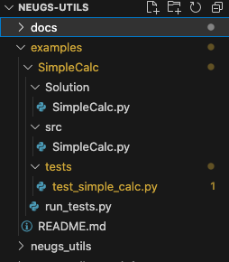

# Getting Started

This page provides a quick overview of how to get started with neugs-utils, and a few examples of how to use it for your classes.

## Installation

To install neugs-utils, run the following command:

```bash
pip install neugs-utils
```

## Mastery Grading Example

The following tutorial is an example on how to use our grader with gradescope. For the most part, this follows the format that student code goes into the `src` folder, and tests are in the `tests` folder. You will need to make sure to have installed the neugs-utils package for them to work. 

To start off, create a working directory ```examples```. This step assumes that you have [neugs-utils](https://pypi.org/project/neugs-utils/) setup on your system. Here is a working tree with the directory setup    

.  

Create your homework assignment ```SimpleCalc.py``` under the ```Solution``` sub-directory and upload your students' ```SimpleCalc.py``` work under the ```src``` sub-directory.  

To add a ```test_simple_calc.py``` test file into the ```tests``` directory use the ```neugs-add -CTestSimpleCalc tests/test_simple_calc.py``` command. Make sure you are in the right ```SimpleCalc``` directory when running this command. The ```TestSimpleCalc``` refers to the class in the test file. You can use ```neugs-add --help``` for a full list of arguements used in the above command.  

Now add unit tests to your test file, under the class that's generated by the above build process.  

The purpose of this tutorial (according to ```neugs-utils```) is to generate a ```.JSON``` file that you will need to upload to gradescope for feedback, as part of the TierMastery grading.  

Run your tests locally using the ```python run-tests.py``` command to see the ```.JSON``` file output.  


### Building the Autograder.zip 

To build the autograder, you simply run it in the directory that contains your src and test directories. It will read and pull every file from your tests folder. You do not have to make a test runner, it will do that for you. 

```bash
neugs-build -o autograder.zip 
```

You will then upload the autograder.zip (or whatever you called it) to Gradescope. 


## Combing Autograding and Manual Grading

TODO: Albert to add this example using one of his courses.